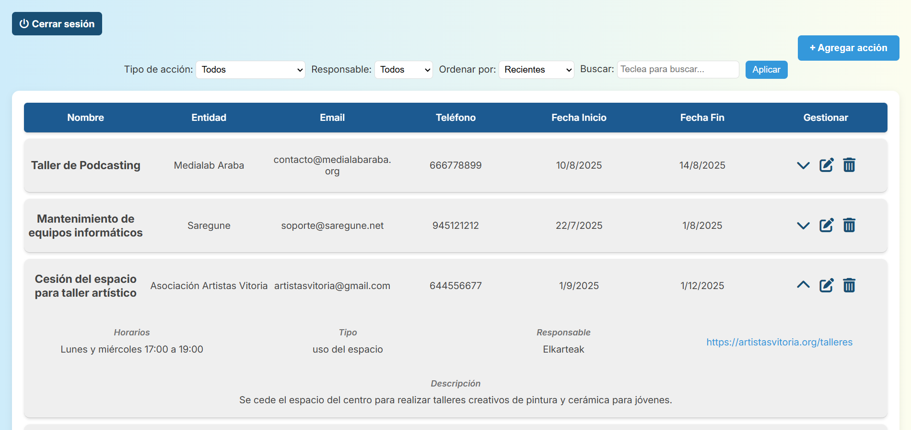

# KUDEHEZI – Gestor de Acciones Empresariales

Aplicación web full-stack para la gestión de acciones, eventos y actividades de una empresa o asociación.  
Incluye autenticación de usuarios, panel de administración y un CRUD completo de acciones con filtros avanzados.

---

---


##  Tecnologías utilizadas
- **Back-end:** Node.js, Express.js
- **Base de datos:** MongoDB
- **Autenticación:** `express-session` + `bcrypt` para hashing de contraseñas
- **Front-end:** EJS, HTML5, CSS3, JavaScript
- **Utilidades:** `dotenv` (variables de entorno), `method-override`
- **Control de versiones:** Git, GitHub
- **Otros:** Font Awesome (iconos), Toast notifications, Dialog API

---

##  Funcionalidades principales
- Registro de usuarios con contraseña cifrada.
- Inicio de sesión con gestión de sesiones.
- Panel principal con listado de acciones en tabla dinámica.
- **CRUD completo** de acciones (crear, editar, eliminar).
- Confirmación con `dialog` antes de eliminar.
- **Filtros avanzados** por tipo de acción, responsable, búsqueda por texto y ordenación.
- Validación de formularios HTML5.
- Notificaciones tipo "toast" para feedback al usuario.
- Diseño responsive en proceso de mejora.

---

##  Instalación y ejecución

1. **Clona el repositorio:**
   ```bash
   git clone https://github.com/Anatolisaief/kudehezi
   cd kudehezi

2. **Instala dependencias:**
   ```bash
    npm install

3. **Configura las variables de entorno en .env:**

    PORT=3000
    SECRET=mitokensecreto

    (si usas MongoDB local no necesitas más, ya que se conecta a mongodb://localhost:27017/kudehezi por defecto)


4. **Ejecuta el servidor en modo desarrollo con nodemon:**
   ```bash
    npx nodemon server.js

5. **Accede desde el navegador:**
   http://localhost:3000/
   